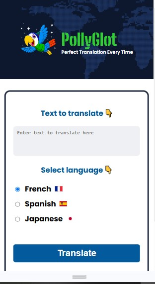

# [Click here to try PollyGlot!](https://pollyglot-translate.netlify.app/)

# PollyGlot: Translation Chatbot



---

## Overview

**PollyGlot** is a translation chatbot designed to break language barriers by providing real-time translation services. Developed to showcase modern web development and machine learning integration, PollyGlot enables users to translate text across 3 languages seamlessly: French, Spanish, Japanese.

---

## Features

- **Real-Time Translation**: Instantly translates input text into the selected target language.
- **Multi-Language Support**: Provides translation for a range of 3 languages.
- **FastAPI Integration**: Utilizes FastAPI to build an efficient and scalable backend API.
- **Customizable Settings**: Allows users to adjust translation preferences.

---

## How to Use

1. Navigate to the PollyGlot demo link above.
2. Enter your message in the input field.
3. Select the desired target language from the menu.
4. Click the "Translate" button to receive the translated text.
5. Interact with the chatbot for follow-up translations or clarifications.

---

## Technologies Used

- **Python**: Primary language for backend development.
- **FastAPI**: Framework for building the scalable backend API.
- **React/JavaScript**: For creating a dynamic and responsive frontend.
- **Google Vertex AI Integration**: Utilizes advanced machine learning models for translation and language processing.
- **Docker**: Used to containerize the application for consistent environment and easy deployment.
- **Google Cloud Run**: Serverless platform for running containers without managing servers.
---

## Project Features

1. **Real-Time Chat Translation**:
   - Processes user input and provides instant translation.
   - Employs state-of-the-art machine learning models for accurate output.

2. **Scalable API Integration**:
   - FastAPI manages translation requests efficiently.
   - Designed for easy deployment and future scalability.

3. **User-Friendly Interface**:
   - Clean, simple modern design for a smooth user experience.
   - Responsive layout that adapts to various device screens.

4. **Error Handling**:
   - Provides feedback in case of translation errors or unsupported language selections.
   - Ensures a stable user experience even with complex inputs.

---

## Project Structure

```
PollyGlot/
├── public/               # Public assets for the React app (favicons, manifest, etc.)
├── src/                  # Main source code for the React frontend
│   ├── assets/           # Images, and other static assets
│   ├── App.jsx           # Root React component
│   ├── Footer.jsx        # Footer component
│   ├── Header.jsx        # Header component
│   ├── MainContent.jsx   # Main content area of the application
│   ├── main.jsx          # Entry point for rendering the React application
├── .dockerignore         # Specifies files and folders ignored by Docker
├── .gitignore            # Excludes logs, dependencies, and environment files from Git
├── Dockerfile            # Instructions for building a Docker image
├── README.md             # Project documentation
├── eslint.config.js      # ESLint configuration for linting React code
├── index.html            # Root HTML file for the React app
├── package-lock.json     # Dependency lock file
├── package.json          # Node.js dependencies and project metadata
├── requirements.txt      # Python dependencies for FastAPI backend
├── server.py             # FastAPI backend server
└── vite.config.js        # Vite configuration for React project
```

---

## 🛠 Installation & Usage

### 1️⃣ Clone the Repository
```bash
git clone https://github.com/your-username/pollyglot.git
cd pollyglot
```

### 2️⃣ Set Up the Backend (FastAPI)
#### Create and Activate a Virtual Environment:
```bash
python -m venv venv
source venv/bin/activate  # On Windows: venv\Scripts\activate
```

#### Install Dependencies:
```bash
pip install -r requirements.txt
```

#### Run the FastAPI Server:
```bash
uvicorn server:app --host 0.0.0.0 --port 8000 --reload
```

### 3️⃣ Set Up the Frontend (React + Vite)
#### Install Node.js Dependencies:
```bash
npm install
```

#### Start the Development Server:
```bash
npm run dev
```

### 4️⃣ Running with Docker (Optional)
If you have Docker installed, you can build and run the app using:
```bash
docker build -t pollyglot .
docker run -p 8000:8000 pollyglot
```

### Deployment on Google Cloud Run
I. Authenticate Google Cloud SDK:
   ```bash
   gcloud auth login
   ```
II. Deploy the containerized app:
   ```bash
   gcloud run deploy pollyglot --image gcr.io/YOUR_PROJECT_ID/pollyglot --platform managed
   ```

---

## 🎯 Features
- FastAPI backend for handling API requests.
- React frontend with dynamic UI.
- Google Vertex AI integration for translation.
- Docker support for easy deployment.

---

## 📜 License
This project is licensed under the MIT License.

---

## 🤝 Contributing
Feel free to fork this repository and submit pull requests. Contributions are welcome! 🚀
